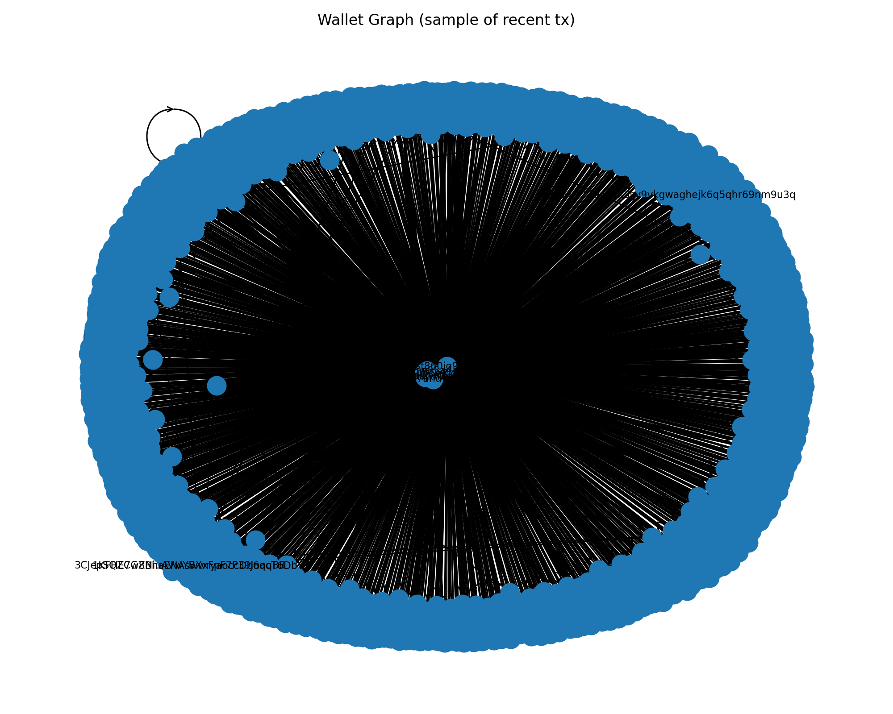
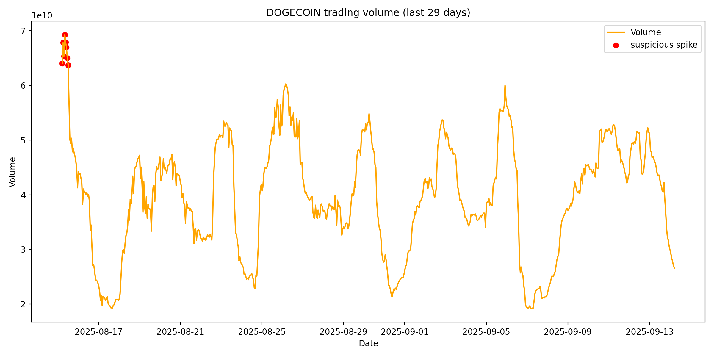

# Crypto Forensics – Challenge 2

This repo has my work for the Data Science (Cryptocurrency) take-home test.  
There are 2 parts:

1. **Task 1** – query transactions from a BTC wallet and make a graph of the addresses.  
2. **Task 2** – do a quick market/forensics analysis on a token to spot weird spikes.  

---

## Setup

I used Python 3.9+ and pip.  

Libraries needed and imported:
- os
- argparse
- requests
- networkx
- matplotlib
- pandas (for Task 2)

Quick install:

```bash
pip install -r requirements.txt 
```

I used the Blockchain.com API to pull a handful of recent BTC transactions.
Each wallet address becomes a node.
Each transaction becomes a directed edge, with the arrows showing who sent to who.
To keep it readable, I only sampled ~10–20 txs. Otherwise the graph becomes too messy. 

Run it like this in terminal: 
```bash
python src/task_one_btc.py --address 1KFHE7w8BhaENAswwryaoccDb6qcT6DbYY --limit 15 --out src/out/task1_graph.png
```


It will print some info (nodes/edges count) and save a PNG.

- Some wallets are super quiet, so if nothing shows up try a busy one (exchange wallets are safe).
- Coinbase/mining txs don’t have an input address, I just label those "COINBASE"

For Task 2, I pulled token data from the CoinGecko API.
I looked at Dogecoin trading volume over the last 30 days and flagged suspicious spikes.
The threshold I used was:

mean volume + 2 × standard deviation

Spikes above that are plotted in red.

Run in terminal: 
```bash
python src/task_two_token.py --token dogecoin --days 30 --out out/task2_doge.png
```


