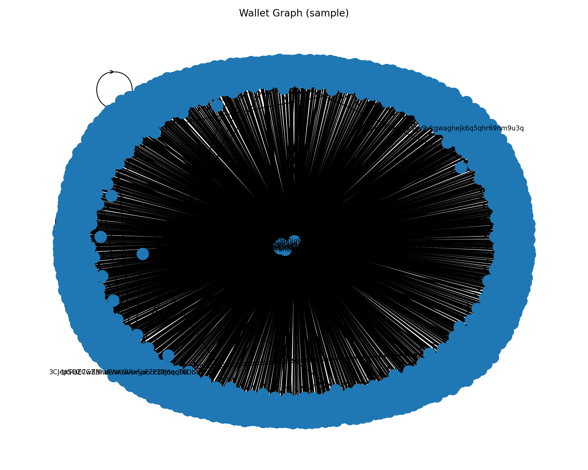

# Crypto Forensics – Challenge 2

This repo has my work for the Data Science (Cryptocurrency) take-home test.  
There are 2 parts:

1. **Task 1** – query transactions from a BTC wallet and make a graph of the addresses.
2. **Task 2** – do a quick market/forensics analysis on a token to spot weird spikes.

---
## Setup

I just used Python 3.9+ and pip. I imported the following libraries: 
os, argparse, requests, networkx, matplotlib.pyplot


Quick install:

```bash
pip install -r requirements.txt


I used the Blockchain.com API to pull a handful of recent BTC transactions.
Each wallet address becomes a node.
Each transaction becomes a directed edge (arrows show who sent to who).
To keep it readable, I only sampled ~10–20 txs (otherwise the graph turns becomes too messy.)

python src/task_one_btc.py --address 1KFHE7w8BhaENAswwryaoccDb6qcT6DbYY --limit 15 --out out/task1_graph.png
It will print some info (nodes/edges count) and save a PNG.

Some wallets are super quiet, so if nothing shows up try a busy one (exchange wallets are safe).
Coinbase/mining txs don’t have an input address, I just label those "COINBASE".

### Example Output



